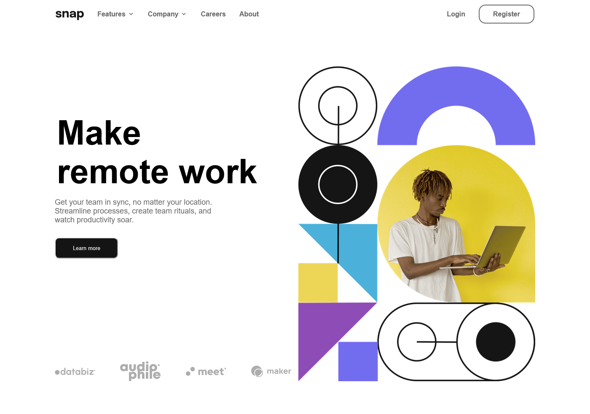
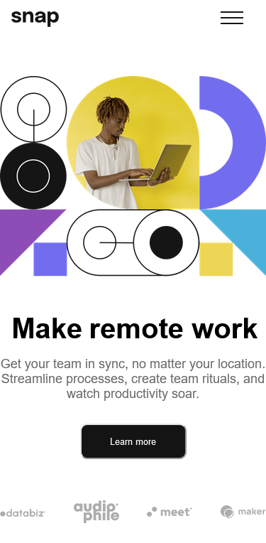

# Frontend Mentor - Intro section with dropdown navigation solution

This is a solution to the [Intro section with dropdown navigation challenge on Frontend Mentor](https://www.frontendmentor.io/challenges/intro-section-with-dropdown-navigation-ryaPetHE5). Frontend Mentor challenges help you improve your coding skills by building realistic projects.

## Table of contents

- [Overview](#overview)
- [The challenge](#the-challenge)
- [Screenshot](#screenshot)
- [Links](#links)
- [Built with](#built-with)
- [What I learned](#what-i-learned)
- [Useful resources](#useful-resources)
- [Author](#author)


## Overview
This is the front end mentor challenge recreation of product Intro section with dropdown navigation solution I did following my other frontend mentor code challenges

### The challenge

Users should be able to:

- View the relevant dropdown menus on desktop and mobile when interacting with the navigation links
- View the optimal layout for the content depending on their device's screen size
- See hover states for all interactive elements on the page

### Screenshot




### Links

- Solution URL: [https://github.com/Qaphael/Intro-section](https://your-solution-url.com)
- Live Site URL: [https://qaphael.github.io/Intro-section/](https://your-live-site-url.com)

## My process

### Built with

- Semantic HTML5 markup
- CSS custom properties
- Flexbox
- CSS Grid
- vscode

### What I learned

I learned and practiced a great deal of flex property in this challenge for positioning
I learnt hoe t create overlays and make sure the mobile menu disappears when clicked. it was challenging but i madde it.

### Code I'm Proud of

```html
<h1>Some HTML code I'm proud of</h1>
<li class="menu-item dropdown">
  <a onclick="myFunctionTwo()" class="dropbtn menu-link" href="#"
    >company <button id="caretTwo" class="burgerTwo"></button
  ></a>
  <div id="myDropdownTwo" class="dropdown-content">
    <a class="nav-link" href="#home">History</a>
    <a class="nav-link" href="#about">our team</a>
    <a class="nav-link" href="#contact">blog</a>
  </div>
</li>
```
```css
.proud-of-this-css {
  color: papayawhip;
}

  .dropdown-content {
    border-radius: 0;
    top: 0rem;
    position: relative;
    box-shadow: none;
    z-index: 4;
  }

```
```js
const proudOfThisFunc = () => {
  console.log('🎉')
}

// Close the dropdown if the user clicks outside of it
window.onclick = function (event) {
  if (!event.target.matches(".dropbtn")) {
    var dropdowns = document.getElementsByClassName("dropdown-content");
    var i;
    for (i = 0; i < dropdowns.length; i++) {
      var openDropdown = dropdowns[i];
      if (openDropdown.classList.contains("show")) {
        openDropdown.classList.remove("show");
        document.body.classList.remove("open");
        document.body.classList.remove("close");
      }
    }
  }
};

```

### Useful resources

- [google fonts](https://fonts.google.com/) - This helped me for fonts i used in this challenge.

## Author

- Website - [Qaphael Opiyo](https://qaphael-portfolio-website.web.app/)
- Frontend Mentor - [@Qaphael](https://www.frontendmentor.io/profile/Qaphael)
- Twitter - [@laflo__lr](https://twitter.com/Laflo_lr)
- Github - [@Qaphael](https://github.com/Qaphael)

